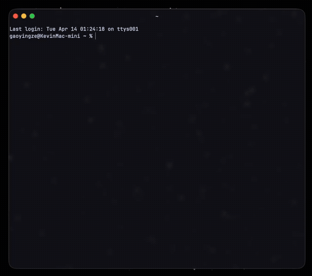

# mcp-multi-model

An MCP server that lets Claude Code query multiple AI models (DeepSeek, Gemini, Kimi, and more) in parallel. Compare answers, leverage each model's strengths, and get real-time monitoring — all from within Claude Code.



## Features

- **Parallel multi-model queries** — Ask one question, get answers from all configured models side by side
- **Streaming output** — Real-time SSE streaming for OpenAI-compatible and Gemini APIs
- **Conversation history** — Multi-turn context with `conversation_id` (30min expiry, up to 10 turns)
- **Built-in tools** — `translate` (CN/EN) and `research` (with web search) out of the box
- **Web search** — Kimi web search and Gemini Google Search grounding
- **Cost tracking** — Per-call token usage and cost estimation based on model pricing
- **Auto-retry** — Exponential backoff on 429/5xx errors and network failures
- **YAML config** — Add new models by editing `config.yaml`, no code changes needed
- **Real-time monitoring** — Optional [Agent Monitor](https://github.com/K1vin1906/agent-monitor) TUI dashboard via Unix socket

## Supported Models

Works with any OpenAI-compatible API or Google Gemini API. Pre-configured examples:

| Model | Adapter | Highlights |
|-------|---------|------------|
| DeepSeek | `openai` | Code, math, logic. Very low cost |
| Gemini | `gemini` | Long context, broad knowledge, Google Search |
| Kimi (Moonshot) | `openai` | Chinese web search, real-time info |
| **Ollama / LM Studio / llama.cpp** | `openai` | **Local models — no API key, no cost, full privacy** |

Add more models (GPT-4o, Qwen, Yi, Mistral, etc.) by adding entries to `config.yaml`. Any OpenAI-compatible API works, including local model runners.

## Installation

### Option 1: npx (recommended)

No install needed. Add to your Claude Code MCP config:

```json
{
  "mcpServers": {
    "multi-model": {
      "command": "npx",
      "args": ["-y", "mcp-multi-model"],
      "env": {
        "DEEPSEEK_API_KEY": "sk-...",
        "GEMINI_API_KEY": "AI..."
      }
    }
  }
}
```

### Option 2: Clone and run locally

```bash
git clone https://github.com/K1vin1906/mcp-multi-model.git
cd mcp-multi-model
npm install
npm run setup   # Interactive setup wizard — validates your API keys
```

Then add to Claude Code config:

```json
{
  "mcpServers": {
    "multi-model": {
      "command": "node",
      "args": ["/path/to/mcp-multi-model/index.js"]
    }
  }
}
```

> API keys can be set via `env` in the config above, or in a `.env` file in the project directory.

## Configuration

Copy and edit the config file:

```bash
cp config.example.yaml config.yaml
```

```yaml
defaults:
  max_tokens: 4000
  temperature: 0.7
  timeout_ms: 60000
  max_retries: 2

models:
  deepseek:
    name: DeepSeek
    adapter: openai                    # openai or gemini
    endpoint: https://api.deepseek.com/chat/completions
    api_key_env: DEEPSEEK_API_KEY      # reads from environment
    model: deepseek-chat
    description: "Code, math, logic. Low cost."
    pricing:
      input: 0.14    # $/M tokens
      output: 0.28

  gemini:
    name: Gemini
    adapter: gemini
    endpoint: https://generativelanguage.googleapis.com/v1beta
    api_key_env: GEMINI_API_KEY
    model: gemini-2.5-flash-preview-04-17
    description: "Long context, broad knowledge, Google Search."
    features:
      - google_search
    pricing:
      input: 0.10
      output: 0.40

  # Add any OpenAI-compatible model:
  # qwen:
  #   name: Qwen
  #   adapter: openai
  #   endpoint: https://dashscope.aliyuncs.com/compatible-mode/v1/chat/completions
  #   api_key_env: DASHSCOPE_API_KEY
  #   model: qwen-plus

  # Local models — no API key needed:
  # ollama:
  #   name: Ollama
  #   adapter: openai
  #   endpoint: http://localhost:11434/v1/chat/completions
  #   model: llama3.2
  #   description: "Local Ollama model. No API key, no cost, full privacy."

tools:
  translate:
    model: deepseek
    description: "CN/EN translation via DeepSeek."
  research:
    model: gemini
    description: "Tech research with web search via Gemini."
```

## Local Models

Any OpenAI-compatible local model runner works out of the box. Just omit `api_key_env`:

**Ollama**
```bash
ollama pull llama3.2
```
```yaml
models:
  ollama:
    name: Ollama
    adapter: openai
    endpoint: http://localhost:11434/v1/chat/completions
    model: llama3.2
    description: "Local Llama 3.2 via Ollama."
```

**LM Studio**
```yaml
models:
  lmstudio:
    name: LM Studio
    adapter: openai
    endpoint: http://localhost:1234/v1/chat/completions
    model: loaded-model
    description: "Local model via LM Studio."
```

**llama.cpp / vLLM / text-generation-webui** — any server with `/v1/chat/completions` endpoint works the same way.

You can mix local and cloud models freely — e.g., use `ask_all` to compare Ollama vs DeepSeek vs Gemini in one call.

## MCP Tools

Tools are dynamically generated from your config. With the default 3-model setup you get:

| Tool | Description |
|------|-------------|
| `ask_deepseek` | Query DeepSeek |
| `ask_gemini` | Query Gemini |
| `ask_kimi` | Query Kimi |
| `ask_all` | Query all models in parallel, compare results |
| `ask_both` | Query any two models in parallel |
| `translate` | CN/EN translation |
| `research` | Tech research with web search |

### Parameters

All `ask_*` tools accept:

| Parameter | Type | Description |
|-----------|------|-------------|
| `prompt` | string | Your question |
| `system_prompt` | string? | Optional system prompt |
| `max_tokens` | number? | Max output tokens (default: 4000) |
| `conversation_id` | string? | Pass same ID for multi-turn conversations |

## Usage in Claude Code

Once configured, just ask Claude naturally:

```
Ask DeepSeek to review this function for bugs
```

```
Use ask_all to compare how each model would implement a binary search
```

```
Research the current state of WebTransport browser support
```

```
Translate this paragraph to English, technical style
```

## Agent Monitor (Optional)

A companion TUI dashboard that shows real-time model activity, streaming output, token usage, and cost tracking.

See [agent-monitor](https://github.com/K1vin1906/agent-monitor) for setup instructions.

## License

MIT
